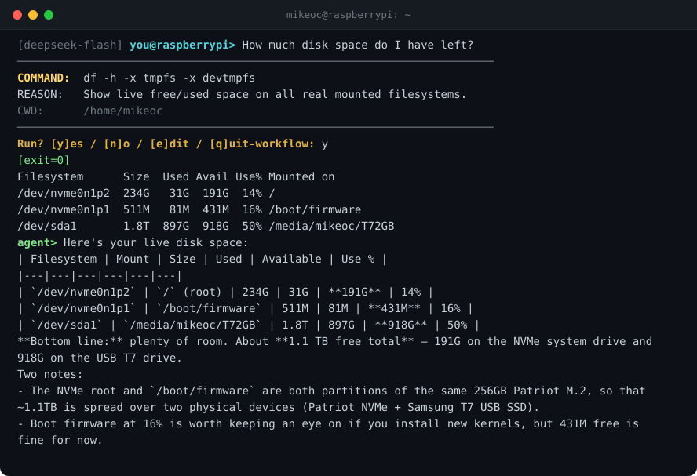

# sys_agent

A minimal command-line agent that connects an arbitrary text prompt to a remote
LLM (OpenAI, Anthropic, or DeepSeek), gathers host facts so generated commands
match the local environment, and executes those commands only after explicit
user approval. Single Python file. No frameworks.

<!-- BEGIN EXAMPLE -->

<!-- END EXAMPLE -->

## Why

Off-the-shelf agentic CLIs (aider, claude-code, etc.) optimize for code
authoring. This agent optimizes for a different loop: ad-hoc system
administration, infrastructure tuning / debugging using commands which
are appropriate for the host environemnt. It's especially useful for posing
system questions where the correct answer depends on OS distro, init system,
installed package manager, and which tools happen to be in user's PATH.

The agent collects and ships a range of host facts to the selected AI model at 
startup so the returned command syntax is properly formatted for the host environment.

## Features

- **Multi-provider**: OpenAI, Anthropic, or DeepSeek, selected at startup.
  Multiple keys present → interactive prompt over those available. One key →
  auto-pick. DeepSeek runs over its OpenAI-compatible endpoint, so it shares
  the OpenAI tool-call message shape.
- **Host-aware prompt**: the input prompt carries the active hostname
  (`you@m3mac>`, `you@raspberrypi>`) so you always know which machine you're
  you're currently working on.
- **Extended thinking** (Anthropic / DeepSeek): optional reasoning pass, opt-in
  per session via `/thinking`. The scratchpad is surfaced inline; off by default
  because thinking tokens bill as output. See [Extended thinking](#extended-thinking).
- **Runtime provider/model switching**: use `/provider` and `/model` to
  inspect or change the active backend during a live REPL (Read-Eval-Print-Lool) session.
- **Host-aware**: distro, shell, machine arch, package/init/container tool
  probes, disk context, and installed tools (`apt`/`brew`/`systemctl`/
  `docker`/etc.) are injected into the system prompt. Host facts can be
  displayed, refreshed, and expanded with `/facts`.
- **Runtime context**: a startup snapshot of the running services and the top
  processes by memory is injected alongside the static facts, so the model
  uses real unit/process names on the first turn instead of probing for them
  (no more guessing `openclaw` when the unit is `openclaw-gateway`).
  Privacy is preserved as only process names are surfaced, never arguments. 
  See [Runtime snapshot](#runtime-snapshot-services-and-processes).
- **Approval-gated execution**: every proposed command is shown with its
  reason and CWD before it runs. Per command you can run it, edit it before
  running, or skip it (decline one step; the agent continues the turn). To
  abandon a multi-command workflow that has gone off the rails, `q` or Ctrl-C
  stops the whole turn and returns you to the prompt, without ending the
  session. See [Interrupting a workflow](#interrupting-a-workflow).
- **Local hard-deny list**: a short list of catastrophic patterns
  (`rm -rf /`, `mkfs`, fork bomb, raw `dd` to block devices) is blocked
  client-side regardless of model output or user approval.
- **Token usage display**: optional per-turn input/output token counts plus
  running session totals and percentage of context window consumed.
- **Color output**: semantic ANSI coloring with auto-detection
  (TTY/`NO_COLOR`) and runtime toggle.
- **Activity indicator**: a spinner with an elapsed-seconds counter during the
  model call and during command execution, so the REPL never looks hung on a
  slow turn or a long-running command. The indicator is suppressed for operations 
  under ~1.5s, shown as a single static marker when output isn't a TTY, and is 
  disabled entirely with `SYS_PROGRESS=off`.
- **Persistent history**: line editing and history navigation via readline
  (gnureadline on macOS). Conversational prompts persist to
  `~/.config/sys_agent/history` across sessions; meta-commands (e.g /thinking on) 
  and short-answer prompts are excluded so Up-arrow recall stays useful.
  See [Tips & shortcuts](#tips--shortcuts) for keystrokes.
- **Audit log**: append-only JSONL record of every command the model
  proposes and its disposition (`run`/`edit`/`skip`/`deny`/`abort`) plus exit
  code, written to `~/.config/sys_agent/audit.log`. The forensic trail a 24/7
  server role needs — distinct from readline history, which stores only your
  prompts. On by default; command output bodies are excluded unless opted in.
  See [Audit log](#audit-log).
- **Zero install footprint with uv**: PEP 723 inline-script dependencies;
  `uv` handles the environment transparently.

## Requirements

- Python ≥ 3.10
- One of: `uv` (recommended) **or** pip + venv
- An OpenAI, Anthropic, and/or DeepSeek API key
- macOS/Linux for the full experience. On Windows, the stdlib lacks
  `readline` — the script still runs, but loses history persistence,
  Up/Down recall, and line-editing keystrokes.

## Install

### With uv (recommended)

```bash
git clone https://github.com/mikeoc61/sys_agent.git
cd sys_agent
chmod +x sys_agent.py
mkdir -p ~/.local/bin
ln -sf "$PWD/sys_agent.py" ~/.local/bin/sys_agent
sys_agent
```

First invocation builds a cached environment from the script's inline
dependency block; subsequent runs are instant.

> **macOS**: the inline block pulls in `gnureadline` automatically
> (`sys_platform == 'darwin'`) to replace the system libedit-backed
> readline with proper GNU readline so colored prompts render correctly
> and Up/Down history navigation redraws cleanly. Linux installs skip
> this dependency.

### With pip + venv

```bash
git clone https://github.com/mikeoc61/sys_agent.git
cd sys_agent
python3 -m venv .venv
source .venv/bin/activate
pip install -r requirements.txt
./sys_agent.py
```

`requirements.txt` carries the same `gnureadline` macOS-only marker as
the inline block.

## Configuration

API keys can come from the shell environment or from a key-value file. If
`SYS_ENV_FILE` is set, that path is used exclusively. Otherwise sys_agent
searches the following locations in priority order and uses the first that
exists:

1. `./.env` — current working directory (dotenv convention)
2. `$XDG_CONFIG_HOME/sys_agent/.env` (default `~/.config/sys_agent/.env`)
3. `~/.sys_agent.env` — home dotfile fallback

Shell-exported variables always override file values.

### Quick setup

```bash
mkdir -p ~/.config/sys_agent
cp .env.example ~/.config/sys_agent/.env
chmod 600 ~/.config/sys_agent/.env
$EDITOR ~/.config/sys_agent/.env
```

The template (`.env.example`) is committed; the real `.env` is gitignored.

### File format

Shell-style `KEY=value`, one per line. `export` prefix and `#` comments
are accepted; matching surrounding quotes are stripped.

```sh
OPENAI_API_KEY=sk-...
ANTHROPIC_API_KEY=sk-ant-...
DEEPSEEK_API_KEY=sk-...
# Optional overrides
SYS_PROVIDER=anthropic
SYS_OPENAI_MODEL=gpt-4o-mini
SYS_ANTHROPIC_MODEL=claude-sonnet-4-6
SYS_DEEPSEEK_MODEL=deepseek-v4-pro
```

### All environment variables

| Var | Purpose | Default |
|---|---|---|
| `OPENAI_API_KEY` | OpenAI auth (one of the three required) | — |
| `ANTHROPIC_API_KEY` | Anthropic auth (one of the three required) | — |
| `DEEPSEEK_API_KEY` | DeepSeek auth (one of the three required) | — |
| `SYS_PROVIDER` | Skip provider prompt: `openai`, `anthropic`, or `deepseek` | (prompt) |
| `SYS_OPENAI_MODEL` | OpenAI model string (default favors reliable tool use; set `gpt-4o-mini` for lower cost) | `gpt-5.4-mini` |
| `SYS_ANTHROPIC_MODEL` | Anthropic model string | `claude-haiku-4-5-20251001` |
| `SYS_DEEPSEEK_MODEL` | DeepSeek model string | `deepseek-v4-flash` |
| `SYS_THINKING` | Startup state for extended thinking: `on` / `off` (Anthropic / DeepSeek) | `off` |
| `SYS_THINKING_EFFORT` | Thinking depth: `low`/`medium`/`high`/`xhigh`/`max` (DeepSeek collapses to `high`/`max`) | `high` |
| `SYS_THINKING_MAX_TOKENS` | Output-token cap on thinking turns (Anthropic only) | `32000` |
| `SYS_THINKING_BUDGET` | Thinking budget for legacy Anthropic models only (Haiku 4.5) | `4000` |
| `SYS_COMMAND_TIMEOUT` | Per-command wall-clock timeout, seconds | `120` |
| `SYS_TOP_PROCESSES` | Top-N processes (by RSS) in the runtime snapshot | `10` |
| `SYS_AUDIT_LOG` | Audit-log path, or `off`/empty to disable | `~/.config/sys_agent/audit.log` |
| `SYS_AUDIT_BODY` | Also log command stdout/stderr in the audit log (capped) | `off` |
| `SYS_ENV_FILE` | Explicit env-file path; skips the search above | (search) |
| `SYS_COLOR` | `on` / `off` / `auto` | `auto` |
| `NO_COLOR` | If set, disables color regardless of `SYS_COLOR=auto` | — |
| `SYS_PROGRESS` | Activity spinner during model calls / command execution: `on`/`off` | `on` |

### Files

| Path | Purpose |
|---|---|
| `~/.config/sys_agent/.env` *(or one of the alternatives above)* | API keys and `SYS_*` overrides |
| `~/.config/sys_agent/history` | Readline history (1000-line cap, persistent across sessions) |
| `~/.config/sys_agent/audit.log` | Append-only JSONL command audit trail (path/disable via `SYS_AUDIT_LOG`) |

The history file is created on first exit. Only conversational prompts are
retained — meta-commands (`/info`, `/exit`, etc.) and short-answer prompts
(`y`/`n`, `1`/`2`) are excluded so Up-arrow recall stays useful. Clear with
`> ~/.config/sys_agent/history` if you ever want a fresh slate.

## Usage

Once running, type natural-language requests. The prompt shows the active
hostname, so it is always clear which machine will execute the command:

```
you@m3mac>       show me which services are using the most RAM
you@raspberrypi> check why bitcoind is restarting
you@raspberrypi> what's the current load average and what process is dominating?
you@m3mac>       upgrade nginx to the latest stable version
```

For mutating actions, the approval prompt is your safety net. Per command:

| Key | Action |
|---|---|
| `y` / Enter | Run the command |
| `n` | Skip this command — the agent **continues** the turn with its next step |
| `e` | Edit the command in place, then run the edited form |
| `q` | **Stop the whole workflow** and return to the prompt (does *not* end the session) |

### Interrupting a workflow

`n` declines a single command and lets the agent carry on. When the agent is
on the wrong path entirely, `q` (or Ctrl-C) abandons the **whole turn** and
drops you back at the prompt to redirect it.

Ctrl-C does this from anywhere in a turn — at the approval prompt, while a
command is running (the command's process group is killed first), or while
the model is still responding. This is the only way to break out of an
`/auto on` run, where there is no per-command prompt.

Stopping **rolls the conversation back** to the start of the turn, so the
interrupted exchange leaves no trace and your next prompt starts clean. Note
the rollback only forgets the attempt in-context — any command that already
executed is **not** undone (its host side effects and audit record stand).

Interrupting never ends the session. At an empty prompt, Ctrl-C just clears
the current line. Quitting stays explicit: `/exit`, `/quit`, or Ctrl-D.

### Tips & shortcuts

Line editing is provided by readline (or gnureadline on macOS, installed
automatically).

| Key | Action |
|---|---|
| Up / Down | Cycle through prior conversational prompts |
| Ctrl-R | Reverse-incremental search through history |
| Ctrl-A / Ctrl-E | Jump to start / end of line |
| Ctrl-W | Delete previous word |
| Ctrl-U / Ctrl-K | Delete to start / end of line |
| Tab | (No completion — sys_agent doesn't bind any) |

History persists across sessions; recall surfaces only real prompts, so
Up-arrow won't waste your time on `y`/`n` answers or meta-commands. To
start with a clean slate: `> ~/.config/sys_agent/history`.

### Meta-commands

| Command | Effect |
|---|---|
| `/exit`, `/quit` | End the session (these and Ctrl-D are the only ways to quit) |
| `/reset` | Clear conversation history and token counters |
| `/info` | Print provider/model, session token usage, host facts |
| `/auto on\|off` | Skip approval prompt (hard-deny list still applies) |
| `/thinking on\|off` | Toggle extended thinking — Anthropic / DeepSeek (takes effect next turn) |
| `/effort [level]` | Thinking depth — Anthropic adaptive (all 5), DeepSeek (`high`/`max`); shows the effective grade; needs `/thinking on` |
| `/tokens on\|off` | Toggle per-turn token-usage line |
| `/tokens` | Print current snapshot without changing toggle |
| `/color on\|off` | Toggle ANSI color output |
| `/audit` | Show audit-log status (enabled, path, body capture) |
| `/audit on\|off` | Toggle the command audit log at runtime |
| `/history` | Review recent command history from the audit log, paged (last 50) |
| `/history N \| all` | Show the last N entries, or the full log |
| `/provider` | Show current provider/model and available providers |
| `/provider openai\|anthropic\|deepseek` | Switch provider and reset conversation/token counters |
| `/model` | Show current model/context-window metadata |
| `/model MODEL_NAME` | Switch the model used by the active provider |
| `/facts` | Print current host facts |
| `/facts refresh` | Re-probe host facts and reset conversation/token counters |
| `/facts verbose on\|off` | Toggle expanded host fact collection and refresh facts |

### Runtime provider/model switching

Provider and model selection are no longer startup-only. During a session:

```text
/provider
/provider openai
/provider anthropic
/provider deepseek
/model
/model gpt-5.4-mini
/model claude-sonnet-4-6
/model deepseek-v4-pro
```

Switching providers resets the active conversation and token counters because
the providers use different tool-call message formats (Anthropic batches
`tool_result` blocks; OpenAI and DeepSeek send one `role: tool` message per
call). Host facts and REPL toggles are preserved.

Changing the model keeps the same provider and session state. Unknown context
windows are allowed; token display falls back to absolute token counts.

### Refreshable host facts

```text
/facts
/facts refresh
/facts verbose on
/facts verbose off
```

`/facts` prints the currently injected host metadata. `/facts refresh`
re-probes the machine and rebuilds the system prompt. Verbose mode adds
additional environment details such as CPU count, PATH, basic container
detection, and network-tool availability. Refreshing host facts resets the
active conversation and token counters so the model receives a clean, current
system prompt.

### Runtime snapshot: services and processes

Alongside the static host facts, startup probes capture a point-in-time
snapshot of what the machine is actually running, so the model uses real
service and process names on the first turn instead of burning a round trip to
discover them. Two keys are injected into the facts when non-empty:

- **`running_services`** — the active services. On Linux, the running `systemd`
  service units (`systemctl list-units --type=service --state=running`); empty
  on hosts without `systemd`, or where the bus is unreachable (e.g. inside a
  container). On macOS, the currently-running `launchctl` jobs with Apple
  system agents and per-GUI-app jobs filtered out (see the platform note),
  leaving the user-relevant daemons (Homebrew, vendor helpers, custom
  LaunchAgents/Daemons).
- **`top_processes`** — the top processes by resident memory (RSS), 10 by
  default (`SYS_TOP_PROCESSES`). Processes sharing a name are aggregated into a
  single entry with summed RSS and an instance `count`, so a worker pool reads
  as one `gunicorn ×8` line rather than eight rows. On Linux this is read
  straight from `/proc` — no `ps` dependency, so it behaves identically across
  distros, init systems, and userlands; on macOS via `ps -axo rss=,comm=`.

Both are a **snapshot taken at startup**, not live state: a process that is hot
at launch may be idle later, and the service list reflects startup. The model
is instructed to use them for naming and orientation but to confirm current
state with a command before acting on a reading. `/facts refresh` re-probes.

**Privacy.** Only the process *name* is recorded — the executable basename,
never its arguments — so secrets passed on a command line (`--password=…`, API
tokens) are dropped before anything is sent to the model.

**Platform note.** The two service lists are intentionally asymmetric. Linux
includes system units (`dbus`, `polkit`, `systemd-*`); macOS drops the
equivalent Apple tier (`com.apple.*`) plus launchd's per-GUI-app jobs
(`application.*`), because launchd registers hundreds of these that would
otherwise bury the handful of services worth naming. The macOS filter lives in
the `_DARWIN_SERVICE_SKIP_PREFIXES` tuple in `sys_agent.py`; extend it if a
host's noise differs. Expect the service list to carry far more signal on a
server — where it names your actual workload — than on a desktop, where it is
mostly background updaters.

### Extended thinking

Anthropic and DeepSeek models support a reasoning pass before the model acts.
It is **off by default**: thinking tokens are billed as output (expensive on
Opus), and routine commands don't need it.

```text
/model claude-opus-4-8
/thinking on
/effort xhigh        # optional; default is high
```

DeepSeek works the same way — `/thinking on` with `deepseek-v4-flash` or
`deepseek-v4-pro`; both tiers support thinking.

Or from the environment:

```sh
SYS_THINKING=on SYS_THINKING_EFFORT=xhigh sys_agent
```

The thinking API differs by model/provider, and sys_agent picks the right one
automatically:

- **Anthropic adaptive** (Opus 4.8 / 4.7, Sonnet 4.6, Opus 4.6): the model
  decides per turn whether and how much to think. Depth is controlled by
  **effort** (`/effort`), not a token budget. Interleaved thinking is automatic.
  Manual budgets are rejected with a 400 on Opus 4.7/4.8 — sys_agent never sends
  them for these models.
- **Anthropic legacy** (Haiku 4.5 and older): use a fixed `budget_tokens` budget
  (`SYS_THINKING_BUDGET`) plus the interleaved-thinking beta header so reasoning
  can span tool calls. Effort does not apply here.
- **DeepSeek** (V4 Flash / Pro): thinking is enabled per turn via the request
  body; depth maps from **effort** to DeepSeek's two grades — `xhigh`/`max` →
  `max`, everything else → `high`. No token budget or max-tokens raise applies.
  DeepSeek imposes a strict replay contract: once a thinking turn makes a tool
  call, the reasoning scratchpad must be echoed back on every subsequent
  assistant message or the next request 400s. sys_agent handles this internally
  by preserving `reasoning_content` on each assistant turn, so multi-turn tool
  use just works.

Behavior, all paths:

- Reasoning is surfaced dimmed, with a `│` margin, ahead of any proposed command
  or final answer.
- The flag is read once at the start of each turn; toggling mid-turn applies on
  the next turn (the API ignores a mid-turn toggle).
- A `[thinking…]` marker is shown while the model works; high-effort Opus turns
  can take a while.
- `/effort` echoes the grade actually used, not just what you typed: on DeepSeek
  it shows the clamped grade with a `(DeepSeek floor)` / `(DeepSeek ceiling)`
  note (`low`–`high` → `high`, `xhigh`/`max` → `max`); on providers/models that
  ignore effort it says `(no effect on this provider/model)`; and it appends
  `needs /thinking on` when effort is set but thinking is off. The stored level
  is your request, so switching to a finer-grained provider still honors it.

Anthropic-specific:

- On a thinking turn the output cap is raised to `SYS_THINKING_MAX_TOKENS`
  (default 32K) so the model has room to reason and act without truncation —
  you are only billed for tokens actually produced. (DeepSeek needs no such
  raise.)
- Thinking turns are streamed internally (required by the SDK once the token
  cap is large) and buffered until complete. DeepSeek uses a plain
  non-streaming call.

**OpenAI**: both flags are inert. Displays say so — the banner and `/help`
show `thinking=on (inactive: openai)`, and `/info` reports `thinking_enabled`,
`thinking_active`, and `thinking_mode`.

Reach for it on a non-obvious multi-step diagnosis (tricky `systemd`,
partitioning, networking). For everyday work, leave it off and stay on a fast
tier (Haiku, Flash).

## Safety model

Three layers, weakest to strongest:

1. **Approval prompt** (default-on, per-command). Every `run_command` shows
   the exact shell string, the model's stated reason, and the CWD before any
   subprocess is spawned. Default answer is `y` so casual `Enter` runs it —
   read the line. Read the line. Per command: `y` run, `n` skip (the agent
   continues), `e` edit, `q` stop the whole workflow. Ctrl-C stops the
   workflow from anywhere in the turn — killing a running command's process
   group first — and returns to the prompt; it never ends the session.
2. **Local hard-deny list** (always-on). A short set of irrecoverable command
   patterns is blocked before the approval prompt is even shown. The model
   cannot disable this and `/auto on` cannot bypass it. Matching is
   intent-based (argv inspection through wrappers like `sudo`/`env`/`timeout`).
   See `is_denied()` and the `_DENY_*` / `_FORKBOMB_RE` tables in
   `sys_agent.py`.
3. **Command timeout** (120s wall-clock per command, configurable via
   `SYS_COMMAND_TIMEOUT`). Prevents runaway model loops from hanging the REPL
   on a single command.

The deny list is intentionally short and pattern-matched. It is **not** a
substitute for paying attention to the approval prompt. Sandbox the agent
(VM, container, `firejail`) if you want to test it on untrusted prompts.

## Audit log

A forensic record of what the agent did — **observability, not a control**. It
does not prevent anything (the approval prompt and deny list do that); it
records what was proposed and what happened, which is what you want after the
fact on a 24/7 host.

On by default. Each `run_command` the model proposes appends one JSON line to
`~/.config/sys_agent/audit.log` capturing its disposition:

| Field | When present | Meaning |
|---|---|---|
| `ts` | always | UTC timestamp, ISO-8601 (`Z`) |
| `host` / `provider` / `model` | always | active host node and backend at execution time |
| `action` | always | `run` / `edit` / `skip` / `deny` / `abort` |
| `command` | always | the command the model proposed |
| `explanation` | when given | the model's stated reason |
| `edited_command` | `action=edit` | the command as you rewrote it before running |
| `returncode` | run/edit | process exit code (`124` = timeout) |
| `truncated` | run/edit | whether output to the model was clipped at `OUTPUT_MAX_CHARS` |
| `reason` | `action=deny` | which hard-deny rule matched |
| `note` | as needed | e.g. `interrupted (workflow stopped)` |
| `stdout` / `stderr` | only with `SYS_AUDIT_BODY=on` | command output, capped at `OUTPUT_MAX_CHARS` |

`abort` records a workflow stopped at the approval prompt (`q` / Ctrl-C)
before that command ran. A command interrupted *mid-execution* by Ctrl-C is
logged as `run`/`edit` with `note: interrupted (workflow stopped)` — it did
start, so its disposition is not `abort`.

Output **bodies are not logged by default** — stdout/stderr can carry secrets.
Enable with `SYS_AUDIT_BODY=on` only if you accept that.

```sh
SYS_AUDIT_LOG=off sys_agent              # disable entirely
SYS_AUDIT_LOG=/var/log/sys_agent.jsonl   # custom path
SYS_AUDIT_BODY=on sys_agent              # include command output (capped)
```

At runtime: `/audit` shows status; `/audit on|off` toggles. Disposition follows
provider/model/host live, so a mid-session `/provider`, `/model`, or `/facts`
switch is reflected in subsequent records. The log is not rotated (one short
line per command); truncate with `> ~/.config/sys_agent/audit.log`.

### Reviewing history

`/history` renders the log as a numbered, human-readable list in **host-local
time** (the stored timestamps are UTC), paged through `$PAGER` (default
`less -RFX`, falling back to `more`). Day-change separators disambiguate
multi-session logs; edited commands show the form that actually ran, and
`skip`/`deny`/`abort` entries are tagged.

```text
/history          # last 50 entries (default)
/history 200      # last 200
/history all      # entire log
```

```
# audit history — last 50 of 312 records  (host-local time)
── 2026-05-31 ──
 1.  17:11:36  systemctl status bitcoind   — Checked bitcoind service status
 2.  17:11:43  tail -100 debug.log | head -50 [edited]   — Reviewed log entries
 3.  17:11:49  bitcoin-cli getblockchaininfo (exit 1)   — Got blockchain status
 4.  17:16:29  rm -rf / [denied: recursive delete targeting the filesystem root]
```

For ad-hoc queries on the raw JSONL, `jq` is still the sharper tool:

```sh
jq -r 'select(.action=="run") | "\(.ts) [\(.returncode)] \(.command)"' \
  ~/.config/sys_agent/audit.log
jq 'select(.action=="deny")' ~/.config/sys_agent/audit.log
```

## Architecture

```
                  ┌────────────────────────────────────┐
                  │           User REPL                │
                  │  (sys_agent.py: run_repl)          │
                  └──────────────┬─────────────────────┘
                                 │
                 host_facts +    │     command output
                 conversation    │     (stdout, stderr, exit)
                                 ▼
                  ┌─────────────────────────────────────────────┐
                  │            Provider abstraction             │
                  │ OpenAIProvider | AnthropicProvider |         │
                  │ DeepSeekProvider (OpenAI-compatible)         │
                  └──────────────┬──────────────────────────────┘
                                 │  HTTPS + tool calling
                                 ▼
                  ┌────────────────────────────────────┐
                  │       Remote LLM API               │
                  └────────────────────────────────────┘
                                 ▲
                                 │  run_command(cmd, reason)
                                 │  ──┐
                                 │    │ approval gate
                                 │    │ deny-list check
                                 │    │ subprocess.run(...)
                                 │    │
                                 ▼    ▼
                  ┌────────────────────────────────────┐
                  │         Local host                 │
                  └────────────────────────────────────┘
```

The provider abstraction normalizes tool-call/tool-result message structure
across the APIs (OpenAI and DeepSeek send one `role: tool` message per call;
Anthropic batches all `tool_result` blocks into a single user message).
`DeepSeekProvider` subclasses `OpenAIProvider` — same wire shape over DeepSeek's
OpenAI-compatible endpoint — overriding only client construction (base URL +
key) and the thinking path (`reasoning_effort` plus `reasoning_content`
preservation). The REPL is provider-agnostic.

### Runtime state

The REPL tracks active provider, active model, host facts, verbosity, token
counters, and conversation messages as mutable runtime state. `/provider`,
`/model`, and `/facts` update that state without restarting the process.

## What this is not

- Not a coding agent. Use aider, claude-code, or Cursor for that.
- Not a long-horizon autonomous agent. There is no planner, no memory beyond
  the active conversation, no parallel workers.
- Not sandboxed. Commands run as the invoking user, with that user's full
  privileges.

## License

MIT — see [LICENSE](LICENSE).
